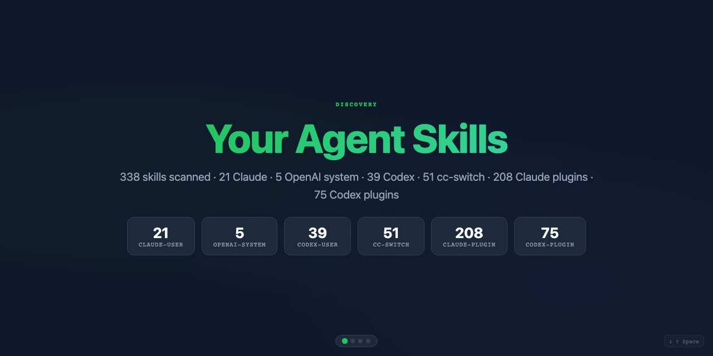

<p align="center">
  
  
  
  
  
  
  
</p>

<p align="center">
  
</p>

> **200+ agent skills installed but you only use 3?**
> One command scans everything — Claude Code, Codex, cc-switch, plugins — and generates a beautiful slide deck so you actually know what you have.
>
> **Plus:** `--health` gives you a personality analysis, radar chart, and smart prescriptions to optimize your skill library.

<p align="center">
  <a href="https://gtskevin.github.io/skill-guide/"><strong>Live Demo</strong></a>
  ·
  <a href="#quick-start">Try it now</a>
  ·
  <a href="#install-methods">Install</a>
  ·
  <a href="#how-it-works">How it works</a>
</p>

```bash
npx skill-guide --open        # ← that's it. HTML slides open in your browser.
```

## What it does

skill-guide reads every skill from Claude Code, Codex, `~/.cc-switch/skills/`, and plugin marketplaces, then generates a polished slide deck you can view in any browser.

**Plus:** Default output now includes token budget analysis. `--insight` gives you personality analysis, radar chart, community comparison, and smart prescriptions.

**6 modes:**

| Mode | Command | Output |
|------|---------|--------|
| **Overview** | `npx skill-guide` or `npx skill-guide --open` | Categories, token budget, highlights, reference |
| **Search** | `npx skill-guide --search security --open` | Find skills by keyword |
| **Deep-dive** | `npx skill-guide --skill investigate --open` | How it works, when to use, limitations |
| **Full** | `npx skill-guide --full --open` | One page per skill, complete reference |
| **Insight** | `npx skill-guide --insight --open` | Health, budget, community comparison, prescriptions |
| **Doctor** | `npx skill-guide --doctor` | Environment diagnostics |

> Legacy flags `--health`, `--wrapped` map to `--insight`. `--recommend` and `--share` remain independent.

## Platform Support

| Platform | Status | Scanned paths |
|----------|--------|---------------|
| **Claude Code** | Supported | `~/.claude/skills`, `~/.claude/plugins/marketplaces` |
| **Codex** | Supported | `~/.codex/skills`, `$CODEX_HOME/skills`, Codex plugin cache |
| **OpenAI system skills** | Supported | `$CODEX_HOME/skills/.system` as a separate source |
| **cc-switch** | Supported | `~/.cc-switch/skills` |
| **Agent Skills** | Compatible | Standard `SKILL.md` skill folders |

## Screenshots



<table>
  <tr>
    <td></td>
    <td></td>
  </tr>
  <tr>
    <td align="center"><em>Cover — total count & sources</em></td>
    <td align="center"><em>Category map — grouped cards</em></td>
  </tr>
  <tr>
    <td></td>
    <td></td>
  </tr>
  <tr>
    <td align="center"><em>Top picks — best skills</em></td>
    <td align="center"><em>Quick reference table</em></td>
  </tr>
</table>

### Health Dashboard Preview

```bash
npx skill-guide --health --open
```

**Terminal output:**
```
🟡 Health Score: 66/100
🏛️ You are: Collector (The Collector)
Your skill library is like a museum — rich and comprehensive, but may need a curator.

📦 Total Skills: 341
🔤 Token Cost: ~20.3K (10.14% of context)
📏 Budget Usage: 504%

💡 Fun Fact: Your 341 skills average ~59 tokens each.
   This means you've used 10.14% of your context window before typing a single character.
   Imagine your laptop using 10.14% of RAM just by booting up.

💡 Optimization Tips [low]
   Your skill library is well-balanced. Top 5 only account for 3%
🛡️ Security Review [medium]
   7 skills have security flags, recommend manual review
📦 Budget Overage [high]
   Total description exceeds budget by 64,647 chars, ~341 skills may be hidden

Token Efficiency ████████░░ 80/100
Organization ██████████ 100/100
Security ███░░░░░░░ 30/100
Freshness ██████████ 100/100
Budget Control ██░░░░░░░░ 19/100
```

## Quick Start

**1. Try instantly** — no install needed:
```bash
npx skill-guide --open
```

**2. Install for Claude Code:**
```bash
npx skills add gtskevin/skill-guide
```

**3. Use it** — type `/skill-guide` in Claude Code, or use the CLI:
```bash
npx skill-guide --open                        # Discover all skills
npx skill-guide --search security --open      # Find skills for a task
npx skill-guide --skill tdd --open            # Deep-dive one skill
npx skill-guide --full --open                 # Generate a full manual
npx skill-guide --doctor                      # Diagnose your setup
```

## Install Methods

```bash
# Claude Code: npx skills (recommended)
npx skills add gtskevin/skill-guide

# Claude Code: manual symlink
git clone https://github.com/gtskevin/skill-guide.git
ln -s $(pwd)/skill-guide ~/.claude/skills/skill-guide

# Claude Code: direct download
mkdir -p ~/.claude/skills/skill-guide
curl -sL https://github.com/gtskevin/skill-guide/archive/refs/heads/main.tar.gz | tar xz --strip-components=1 -C ~/.claude/skills/skill-guide

# Codex: manual symlink
git clone https://github.com/gtskevin/skill-guide.git
mkdir -p "${CODEX_HOME:-$HOME/.codex}/skills"
ln -s "$(pwd)/skill-guide" "${CODEX_HOME:-$HOME/.codex}/skills/skill-guide"
```

## Usage Examples

### Run as a CLI
```bash
npx skill-guide --open
npx skill-guide --search security --open
npx skill-guide --skill test-driven-development --open
npx skill-guide --share --open                    # Share your skill stack
npx skill-guide --recommend --open                # Get recommendations
npx skill-guide --health --open                   # Health dashboard with personality & radar chart
npx skill-guide --wrapped --open                  # Generate your personal skill report
npx skill-guide --format json
npx skill-guide --doctor
```

### Discover all your skills
```
/skill-guide
```
Or say: "What skills do I have?" / "帮我看看我有哪些技能"

In Codex, you can also say: "What Codex skills do I have?"

### Deep-dive one skill
```
/skill-guide investigate
```
Or say: "Tell me about the TDD skill" / "介绍一下 investigate 技能"

### Find the right skill
```
Which skill should I use for code review?
```
Or: "帮我推荐一个做测试的技能"

### Generate a full manual
```
/skill-guide all
```

### Share your skill stack
```bash
npx skill-guide --share --open                    # Generate portfolio page
npx skill-guide --share --user @gtskevin --open   # With personalized tag
```

### Get recommendations
```bash
npx skill-guide --recommend --open                # HTML report
npx skill-guide --recommend                       # Terminal output
npx skill-guide --recommend --format json         # JSON for agents
```

### Health check your skills
```bash
npx skill-guide --health --open                   # Full HTML dashboard
npx skill-guide --health                          # Terminal output
npx skill-guide --health --lang zh --open         # Chinese UI
```

**What you get:**
- **Health Score** — 0-100 rating of your skill library's health
- **Personality Analysis** — Are you a Collector, Minimalist, Security Expert, or Specialist?
- **Five-Dimension Radar Chart** — Token Efficiency, Organization, Security, Freshness, Budget Control
- **Smart Prescriptions** — Actionable recommendations based on your actual skill data
- **Fun Facts** — "Your 341 skills use 10% of your context window before you type a single character!"
- **One-Click Share** — Copy report to clipboard for sharing

### Personal Skill Report (--wrapped)

Your "Spotify Wrapped" for AI skills:
- Skill personality type (Collector, Minimalist, Security Expert, etc.)
- Community comparison (percentile rankings vs other users)
- Skill DNA breakdown (category distribution)
- Skill stack valuation
- Shareable HTML report with one-click copy

## How it works

```
skill-guide/
├── SKILL.md              # Skill definition + HTML generation rules
├── agents/openai.yaml    # Codex/OpenAI skill UI metadata
├── skill-guide.js        # Deterministic CLI + HTML generator
├── scan-skills.js        # Zero-dependency Node.js scanner
├── skill-registry.js     # Online directory fetching + recommendation engine
├── demo.html             # Demo presentation (this is what you see above)
└── LICENSE               # MIT
```

1. `scan-skills.js` scans Claude Code, Codex, cc-switch, and plugin skill directories; parses YAML frontmatter; extracts sections and key paragraphs
2. `skill-guide.js` turns scanner JSON into deterministic HTML slides with scroll-snap navigation, keyboard controls, and animations
3. `SKILL.md` lets Claude Code and Codex invoke the same CLI from natural language
4. Output opens in your browser — zero config, zero dependencies

### Scanner modes

| Flag | Purpose | Data |
|------|---------|------|
| `--list` | Discovery | Name + description + category |
| `--skill <name>` | Deep-dive | Full metadata + sections + key paragraphs |
| `--search <query>` | Recommendations | Matching skills with full data |
| `--full` | Complete manual | All skills with full data |
| `--refresh` | Force re-scan | Ignores 5-min cache |

### CLI flags

| Flag | Purpose |
|------|---------|
| `--open` | Open the generated HTML in your browser |
| `--output <file>` | Save HTML to a specific path |
| `--format html,json` | Choose HTML slides or raw scanner JSON |
| `--search <query>` | Generate recommendations for a task |
| `--skill <name>` | Generate a deep-dive for one skill |
| `--full` | Generate a complete manual |
| `--share` | Generate a shareable portfolio HTML |
| `--user <name>` | Add personalized tag to share page |
| `--recommend` | Show skill recommendations from online directories |
| `--health` | Generate health dashboard with personality analysis, radar chart, and prescriptions |
| `--lang <code>` | UI language (en, zh, or any — auto-translated) |
| `--doctor` | Check paths, sources, and scan counts |

### Doctor checks

`npx skill-guide --doctor` reports Node.js version, Claude Code and Codex skill paths, source counts, duplicate skill names, malformed skill files, and suggested install paths.

### Auto-categorization

Skills are automatically sorted into 9 categories: `testing`, `design`, `security`, `documentation`, `automation`, `deployment`, `code-quality`, `development`, `other`.

## Language Support

Automatic — ask in any language, get output in that language. No configuration needed.

- **English** — default
- **Chinese** — built-in (`--lang zh`)
- **Japanese, Korean, French, German, Spanish, ...** — agent-side translation (works in Claude Code and Codex)

## Why skill-guide?

- **The only skill that maps your skills** — scans Claude Code, Codex, cc-switch, and plugin sources in one visual overview
- **Health dashboard** — personality analysis, radar chart, and actionable prescriptions to optimize your skill library
- **Zero dependencies** — pure Node.js with `fs`, `path`, `os`. No `npm install` needed
- **Beautiful output** — scroll-snap slides with keyboard nav, animations, and responsive design
- **Any language** — ask in Chinese, get Chinese. Ask in Japanese, get Japanese. Auto-detected.
- **Smart caching** — 5-minute TTL so repeated queries are instant
- **5 seconds to "wow"** — `npx skill-guide --open` is all you need

## Contributing

See [CONTRIBUTING.md](CONTRIBUTING.md) for guidelines.

## Roadmap

- [x] `--share` — generate a shareable standalone HTML or Markdown summary
- [x] `--health` — health dashboard with personality analysis, radar chart, and prescriptions
- [ ] Gemini CLI skill scanning (`~/.gemini/skills`)
- [ ] `--diff` — show recently added/removed skills since last scan
- [ ] `--export markdown` — output a Markdown table for pasting into issues and docs

Have an idea? [Open a feature request](https://github.com/gtskevin/skill-guide/issues/new?template=feature_request.yml).

## License

MIT
