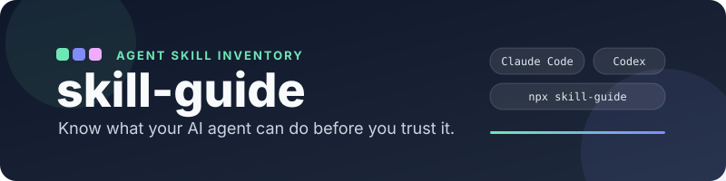
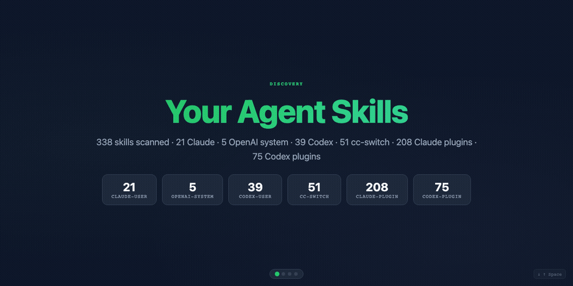
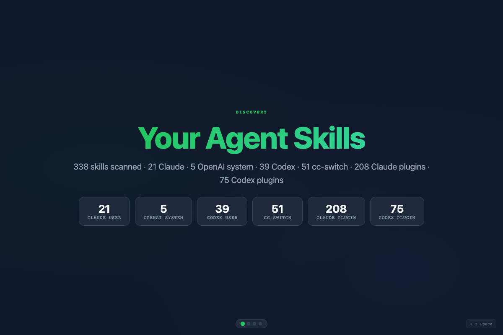
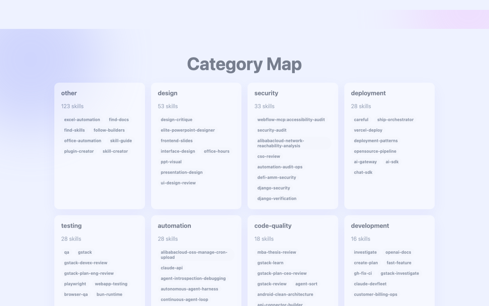
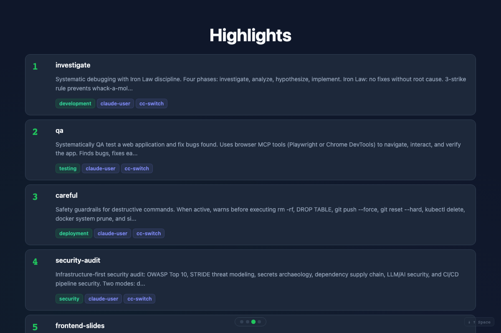
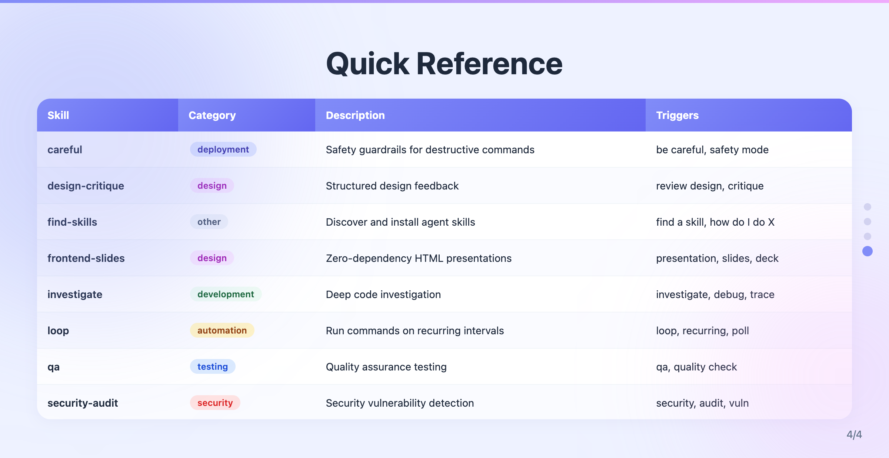
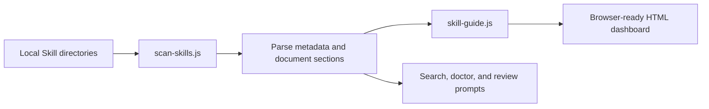

<div align="center">

<picture>
  
</picture>

<br />

[](https://www.npmjs.com/package/skill-guide)
[](https://www.npmjs.com/package/skill-guide)
[](https://github.com/gtskevin/skill-guide/actions/workflows/test.yml)
[](LICENSE)

**Inspect, find, and review your installed Agent Skills across Codex and Claude Code.**

[Live Demo](https://gtskevin.github.io/skill-guide/) · [Quick Start](#quick-start) · [npm](https://www.npmjs.com/package/skill-guide) · [FAQ](#faq)

</div>

---

> [!NOTE]
> You installed a useful Skill from someone else. But what will it actually do? When should it activate? Do you already have another Skill for the same job? Is its description heavy enough to deserve a closer look?
>
> `skill-guide` gives you a local map before you place uncertain trust in downloaded Agent Skills.

## Highlights

| | Capability | Why it matters |
|---|---|---|
| 🔍 | **Inventory your Skills** | See what is installed across Codex, Claude Code, cc-switch, and plugin directories. |
| 🎯 | **Find a Skill for a task** | Search names, descriptions, and declared triggers before installing another tool. |
| 📖 | **Inspect how a Skill is designed to work** | Review its source, declared tools, use cases, limitations, and document structure. |
| 🛡️ | **Review before you trust** | Surface local metadata signals such as sparse descriptions, duplicate sources, and estimated description tokens. |
| 🎯 | **Platform-scoped views** | Default to your current agent's Skills; use `--platform` or `--all` to switch scope. |

## Quick Start

> ⏱️ **Get started in 30 seconds**

No installation is required for the CLI:

```bash
npx skill-guide
```

The dashboard opens in your browser. The terminal also prints a local summary:

```text
skill-guide · 338 skills · Local profile: Collector

Health: 68/100
338 skills · 9/9 categories · ~20.0K description tokens
Sources: 59 user-directory · 280 plugin-directory
16 skills have sparse metadata — review descriptions and triggers
```

> [!IMPORTANT]
> Token numbers are rough estimates for Skill descriptions, not measured runtime cost. Health output is a local review prompt, not a verdict on quality or safety.

## Demo

<div align="center">
  
</div>

<table>
  <tr>
    <td></td>
    <td></td>
  </tr>
  <tr>
    <td align="center"><em>Local inventory and sources</em></td>
    <td align="center"><em>Category map</em></td>
  </tr>
  <tr>
    <td></td>
    <td></td>
  </tr>
  <tr>
    <td align="center"><em>Review highlights</em></td>
    <td align="center"><em>Quick reference</em></td>
  </tr>
</table>

## What It Can Tell You

`skill-guide` is a local inventory, discovery, and **pre-use review** tool. It deliberately separates evidence from inference.

| Question | What `skill-guide` does today | Boundary |
|---|---|---|
| What Skills do I have? | Scans local user, system, cc-switch, and plugin directories. Defaults to the current agent's Skills. | Reports what is visible on the current machine. Use `--all` for cross-platform inventory. |
| Do I already have a Skill for this task? | Searches names, descriptions, and declared triggers with `--find`. | Returns metadata matches, not a semantic guarantee. |
| How is this Skill designed to work? | Shows source, declared tools, use cases, limitations, and document sections. | Explains documented intent; it does not execute an audit of every command. |
| Could Skill descriptions be heavy? | Estimates description tokens and highlights longer descriptions. | Does not measure runtime tokens, API cost, or context injection behavior. |
| Was a Skill actually invoked? | Not yet. | Runtime invocation tracking requires logging integrations. |
| Is the output good or cost-effective? | Not yet. | Result quality and actual cost require runtime evidence and evaluation. |

## Commands

| Goal | Command |
|---|---|
| Open your local dashboard | `npx skill-guide` |
| Find a Skill for a task | `npx skill-guide --find security` |
| Inspect one Skill | `npx skill-guide --find test-driven-development` |
| Diagnose local setup | `npx skill-guide --doctor` |
| Review directory mentions and same-category candidates | `npx skill-guide --recommend` |
| Generate a shareable local profile | `npx skill-guide --share` |
| Return structured scanner data | `npx skill-guide --format json` |
| Focus on one agent's Skills | `npx skill-guide --platform claude` |
| Include every detected platform | `npx skill-guide --all` |

### Example Prompts

When `skill-guide` is installed as an Agent Skill, try:

```text
What Skills do I already have for code review?
Show me how the test-driven-development Skill is designed to work.
帮我看看我有哪些 Codex Skills，并找出描述信息较少、值得人工复核的项目。
```

## Install as an Agent Skill

For Claude Code:

```bash
npx skills add gtskevin/skill-guide
```

For Codex:

```bash
git clone https://github.com/gtskevin/skill-guide.git
mkdir -p "${CODEX_HOME:-$HOME/.codex}/skills"
ln -s "$(pwd)/skill-guide" "${CODEX_HOME:-$HOME/.codex}/skills/skill-guide"
```

<details>
<summary>More installation options</summary>

```bash
# Claude Code: manual symlink
git clone https://github.com/gtskevin/skill-guide.git
ln -s "$(pwd)/skill-guide" ~/.claude/skills/skill-guide

# Claude Code: direct download
mkdir -p ~/.claude/skills/skill-guide
curl -sL https://github.com/gtskevin/skill-guide/archive/refs/heads/main.tar.gz \
  | tar xz --strip-components=1 -C ~/.claude/skills/skill-guide
```

</details>

## Platform Support

| Platform | Status | Scanned paths |
|---|---|---|
| Claude Code | Supported | `~/.claude/skills`, `~/.claude/plugins/marketplaces` |
| Codex | Supported | `~/.codex/skills`, `$CODEX_HOME/skills`, Codex plugin cache |
| OpenAI system Skills | Supported | `$CODEX_HOME/skills/.system` |
| cc-switch | Supported | `~/.cc-switch/skills` |
| Agent Skills | Compatible | Standard `SKILL.md` folders |

## How It Works



The scanner uses Node.js built-ins only:

1. Scan local Skill directories and plugin caches.
2. Parse frontmatter, descriptions, triggers, declared tools, and selected document sections.
3. Estimate description tokens and surface deterministic local review prompts.
4. Render a standalone HTML dashboard that opens in your browser.

> [!WARNING]
> `skill-guide` does not silently delete, install, or modify your Skills. Review prompts require human judgment.

## FAQ

<details>
<summary>Does skill-guide send my local Skills to a server?</summary>

No. Core scanning and dashboard generation run locally with Node.js built-ins. The optional `--recommend` command reads public online directories to show directory mentions.
</details>

<details>
<summary>Can it tell whether Claude Code or Codex actually invoked a Skill?</summary>

Not yet. The current release scans local metadata. Reliable invocation tracking requires runtime logs or platform integrations.
</details>

<details>
<summary>Does the token estimate equal my real API cost?</summary>

No. It is a rough estimate based on description text. Runtime token usage depends on the platform, model, loaded context, and execution path.
</details>

<details>
<summary>Does a health warning mean I should delete a Skill?</summary>

No. Warnings are review candidates. Read the Skill, check its source, and confirm your actual needs before changing anything.
</details>

<details>
<summary>Which languages are supported?</summary>

Dashboard labels are built in for English and Chinese. Agents can summarize the result in other languages without rewriting the generated HTML.
</details>

## Contributing

Issues and pull requests are welcome. See [CONTRIBUTING.md](CONTRIBUTING.md) for the zero-dependency constraint and test commands.

## License

[MIT](LICENSE)

---

<div align="center">
  <sub>Built with care by <a href="https://github.com/gtskevin">@gtskevin</a> for developers who want to understand Agent Skills before trusting them.</sub>
</div>
